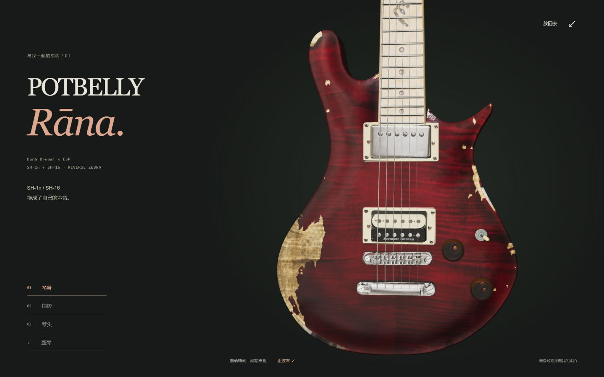
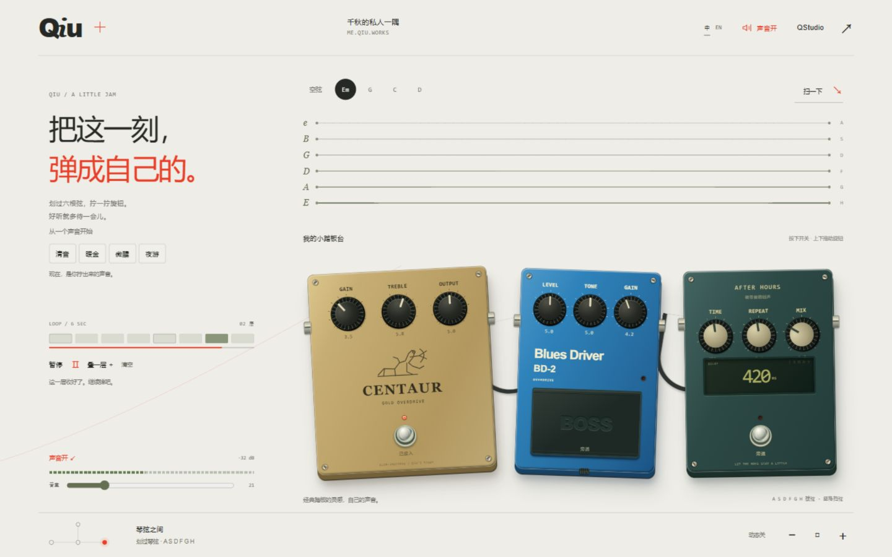
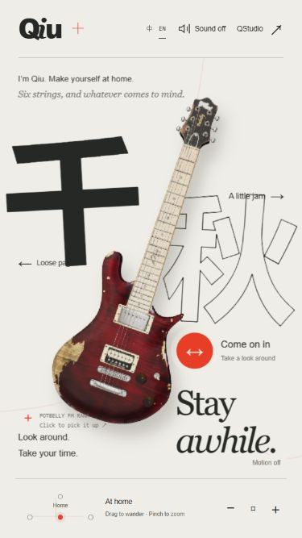
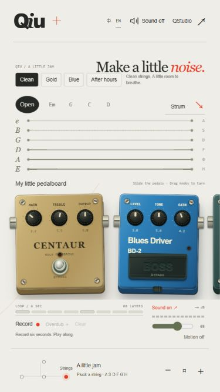

# 个人空间接入检查 · 2026-09-22

检查对象是 `npm run build` 后通过 Astro preview 提供的根站构建产物。

- `npm run build` 通过，生成 20 个页面。Vite 提示 Three.js 所在模块超过 500 kB；没有新增包，也没有修改音频算法或吉他几何。
- 中英文首页的资源和站内链接均指向实际构建文件；无 `_room` / `rewrite.html` 原型路径，canonical、alternate、robots 和 sitemap 使用 me.qiu.works。
- 英文保留「千秋」，界面标签完成翻译。切换语言保持 `#music`，录音和声音状态随页面导航复位。
- 桌面 1440 × 900：打开吉他、切到琴头、返回；金色音色、键盘调节 Gain、Em 和弦、扫弦、6 秒录音、叠录和静音可操作。
- 平板 768 × 1024：英文散页与新增档案导航；链接分别为 `/en/blog/`、`/en/projects/`。
- 小屏 375 × 667：英文首页、音乐区与画线入口无页面横向溢出；踏板保持独立横向区域，画线起点与清空可操作。
- 上述交互检查未发现浏览器控制台错误或警告。浏览器当前减少动态偏好生效；沿用原型的动态开关与照片回退。本次未另做实体触屏、无 WebGL 或禁用 JS 的设备测试。
- 首页分享图为实际页面的 1200 × 630 捕获，查看 [中文](../../../public/assets/og/me-zh.jpg) / [英文](../../../public/assets/og/me-en.jpg)。

## 实际构建截图

| 小屏首页 | 小屏音乐区 |
| --- | --- |
|  |  |

未发布到 Cloudflare，也未更改其域名绑定。QStudio 应用及原目录上的未推送提交保持原状。
