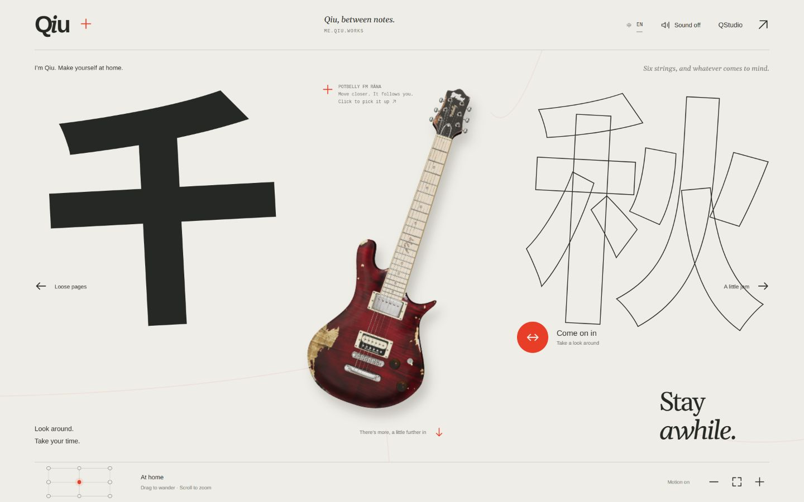
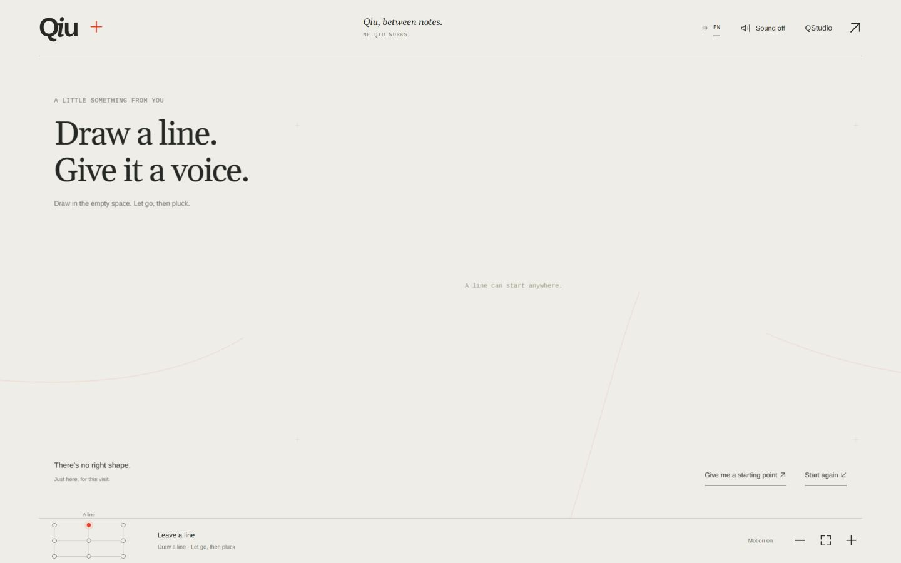
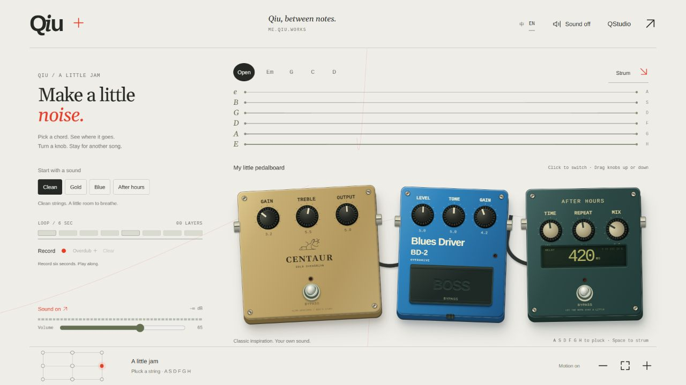
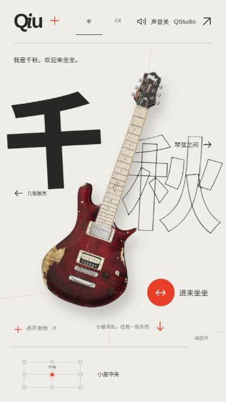
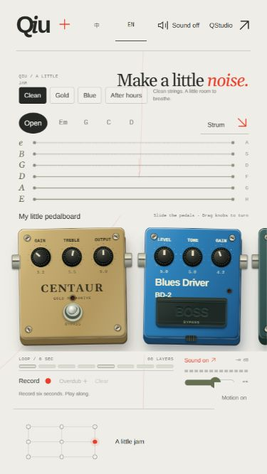
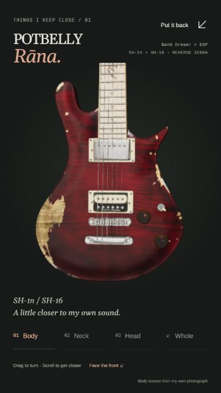

# 首页字体与控制符号检查 · 2026-09-30

检查对象为 `npm run build` 后的根站产物，通过 Astro preview 在本地提供。
本次使用 Windows 上的 Codex 内置 Chromium 浏览器；以下尺寸是页面实际视口与截图尺寸。

- `npm run build` 通过，生成 20 个页面。仍有既有 Three.js 模块超过 500 kB 的提示；没有新增运行时依赖。
- 首页自托管 Arimo / Gelasio / Cousine / Noto Sans SC / Noto Serif SC。七个 WOFF2 文件合计 333,100 字节，其中 3,612 字节的 display 子集由 Vite 内联到 CSS；这是资产大小，未测实际网络耗时或性能指标。
- 字体来源固定在 Google Fonts 的指定 commit，完整 OFL 授权随资产保存并嵌入 WOFF2 的 name 表，部署文件也携带版权与许可。字体生成脚本通过当前首页 CJK 和 display 字符覆盖断言；踏板罗马刻度使用 ASCII。
- 桌面 1440 × 900：英文首页、`#trace`、`#music` 的字形与箭头正常；描线起点和清空、局部声音开关、录音完成、播放/暂停、叠录保存及清空时，SVG 与按钮标签、状态同步。
- 最终构建再检查 1280 × 720 的英文音乐区及 375 × 667 的刻度，确认 ASCII 罗马刻度和自托管字体加载正常。
- 小屏 375 × 667：中文首页、中英文音乐区、英文作品区和深色吉他近看可用，未见页面横向溢出；独立踏板横向区域保留。作品铭牌与画布文字使用首页字体栈。
- `#paths` 播放/停止的图标和 `aria-pressed` 同步；`#blindspot` 的「确定」字形缓存使用已加载的 display 字体。中文/英文切换保持当前 `#music` / `#blindspot` 位置。
- 失败场景：临时本地服务器对外部 WOFF2 返回 404，并仅让第一次音频初始化失败。确认 sans/serif 字体未加载，系统回退文字仍可读，SVG 保留且页面无横向溢出。声音不可用时图标隐藏，重试成功后恢复箭头与 `aria-pressed=true`。内联 display 子集仍可用。
- 浏览器未记录新增脚本错误；Three.js 环境贴图采样仍有原有警告。未在 Safari / Firefox、macOS / Android 或实体触屏上测试，也未验证真实音频输出、表单提交和性能指标。

阅读页和 QStudio 的字体、内容与主题不在此次改动范围内。保留空间发现入口，没有增加首屏导航。

## 实际构建截图

| 中文首页，375 × 667 | 英文音乐区，375 × 667 | 吉他近看，375 × 667 |
| --- | --- | --- |
|  |  |  |

