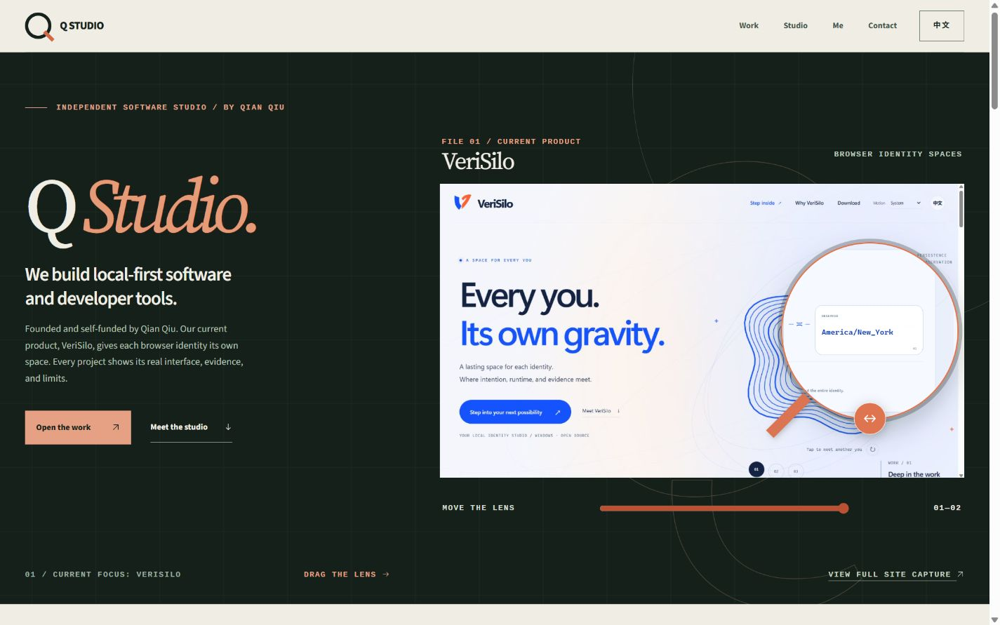
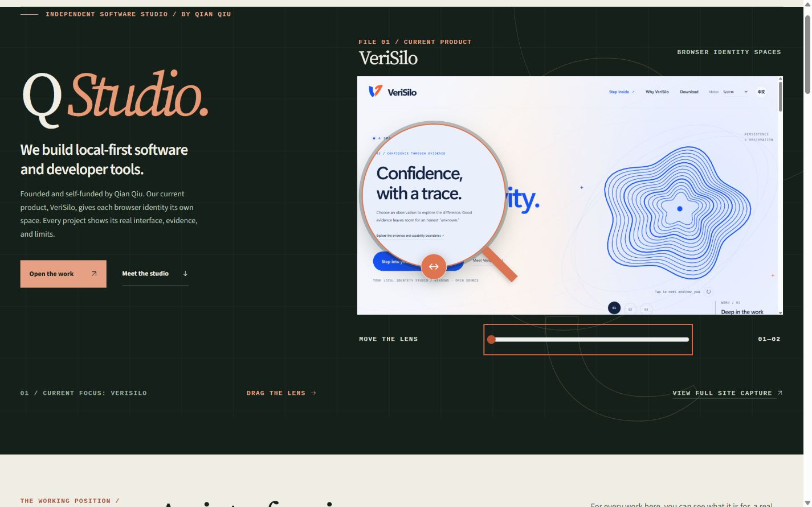
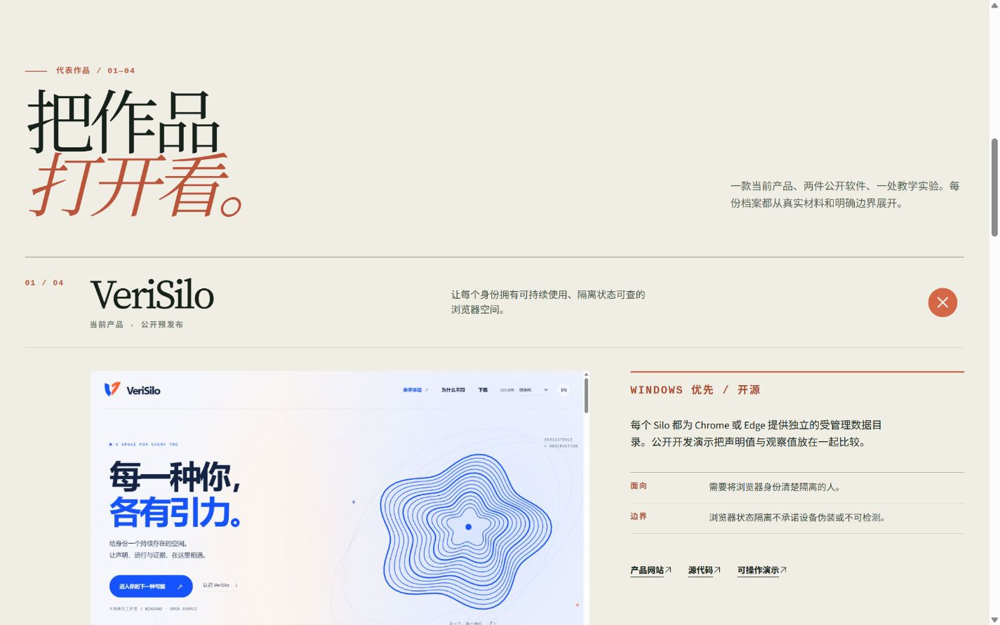
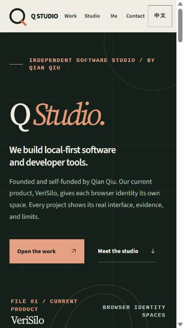
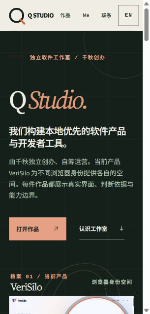
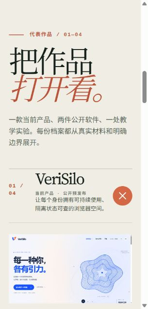

# QStudio 字体与控制符号检查 · 2026-09-30

本次修复基于个人站 PR #80 的提交，新增 PR 只包含 QStudio 与对应约定、验收资料。
检查对象为 `npm run build:developer` 的实际构建产物，通过本地 Astro preview 提供。
浏览器为 Windows 上的 Codex 内置 Chromium。下列尺寸为页面报告的 CSS 视口；截图保留工具返回的原图，像素尺寸可能略有缩放。

- 最终 `npm run build:developer` 通过，生成 `/`、`/zh/` 两个页面；没有新增运行时依赖，也未修改个人站实现。
- 六个独立 WOFF2 合计 231,616 字节。Source Sans 3 与 Noto Sans SC 保留真实 400–900 字重；Source Serif 4 正常 / 斜体固定 400 字重、光学字号 20；Cousine Bold 为真实 700。固定来源、内嵌 OFL 与内部字体名称已检查，当前源码的 98 个 Latin 字符、396 个 CJK 字符完整覆盖。
- 中英文各 28 个构建期 SVG；剥离原字符符号与新增 SVG 后，两份 HTML 的原文字、链接、ARIA 和原生结构一致。字体成功加载，SVG 都为装饰图标，不进入读屏名称。
- 桌面 1440 × 900：英文首屏、中文作品区字形与层级正常。镜片键盘 Home / End 显示左右端点，最左端证据标题完整可读；直接拖动镜片和橙色手柄下半圆都更新滑条、ARIA 值与截图位置。
- 项目组可用键盘展开、关闭，保留原生互斥行为；图片对话框可用 SVG 关闭按钮和 Escape 返回，焦点回到原图片链接。
- 中文 / 英文切换保留 `#work`、`#top`；两个页面的本地字体与图标正常。
- 768 × 1024：英文首页、中文作品区可读且无页面水平溢出。375 × 667：英文首页与作品标题完整。320 × 667：中英文、中文作品区和导航可读，`scrollWidth` 与 `clientWidth` 相同；去掉原有 320px body 下限，避免滚动条挤出 15px 水平溢出。
- 字体失败：临时本地服务器对全部 WOFF2 返回 404。中英文在 320 × 667 仍可读，sans / serif / mono / CJK 加载检查为 false，28 个 SVG 保留，页面没有水平溢出。
- 浏览器未记录脚本错误或警告。尚未在 Safari / Firefox、macOS / Android 或实体触屏上复核；没有测量真实网络性能或字体栅格化的像素一致性。

保留原配色、页面布局、真实产品截图、文案与链接。两个 PR 均交回用户审核，不启用自动合并。

## 实际构建截图

| 英文 375px 首页 | 中文 320px 首页 | 中文 320px 作品区 |
| --- | --- | --- |
|  |  |  |

