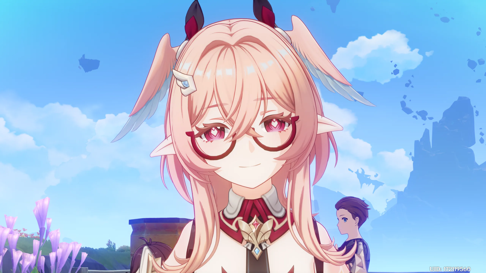
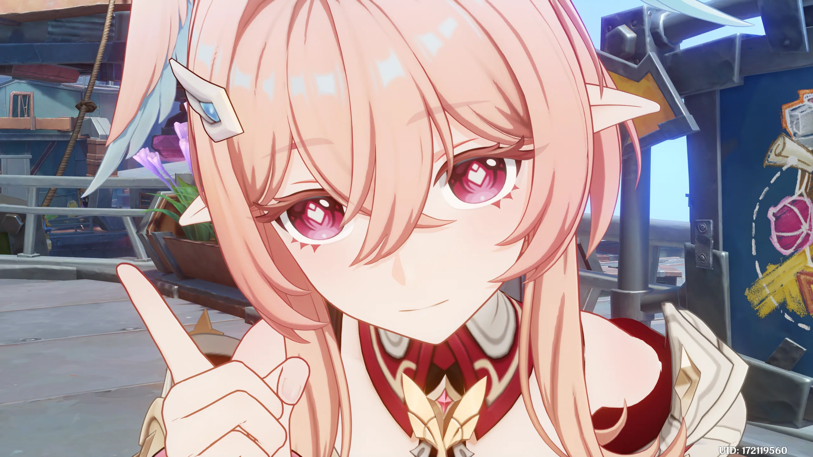
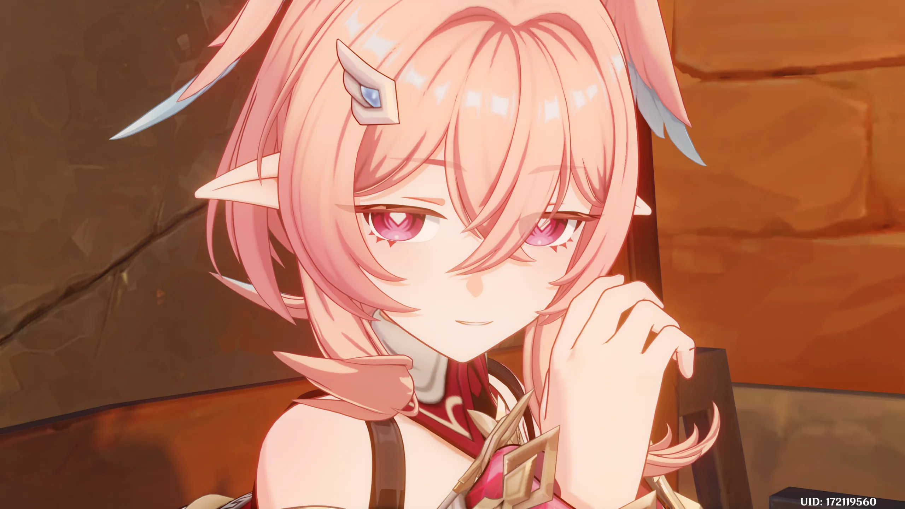
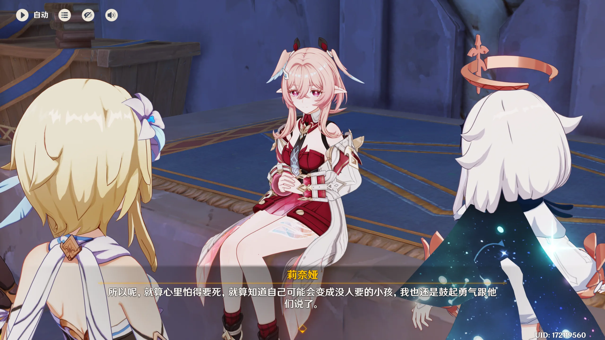
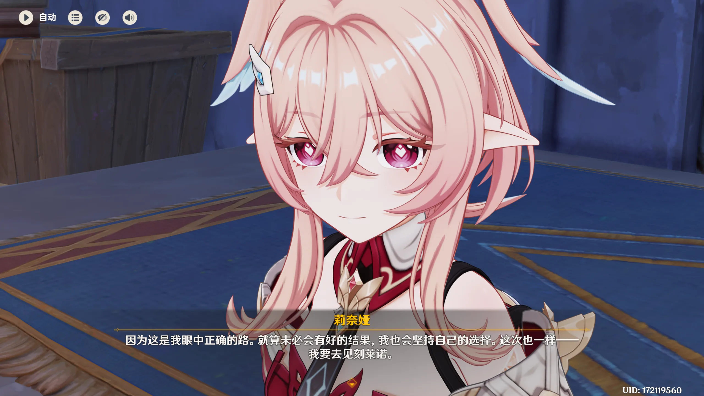
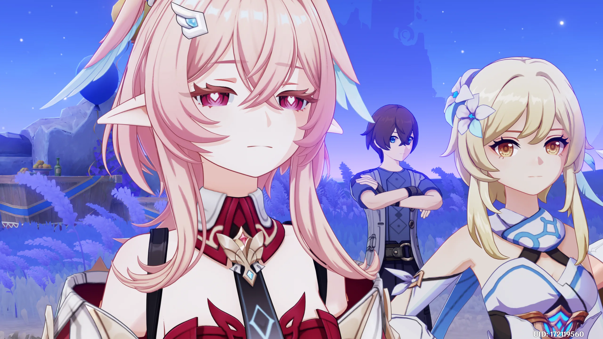
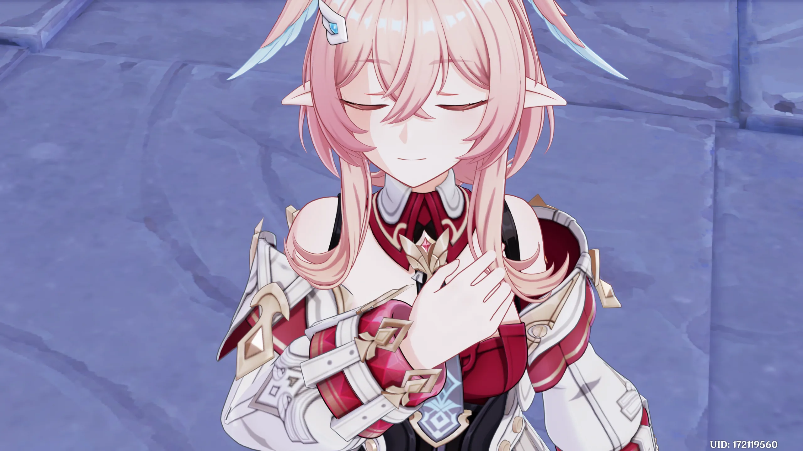
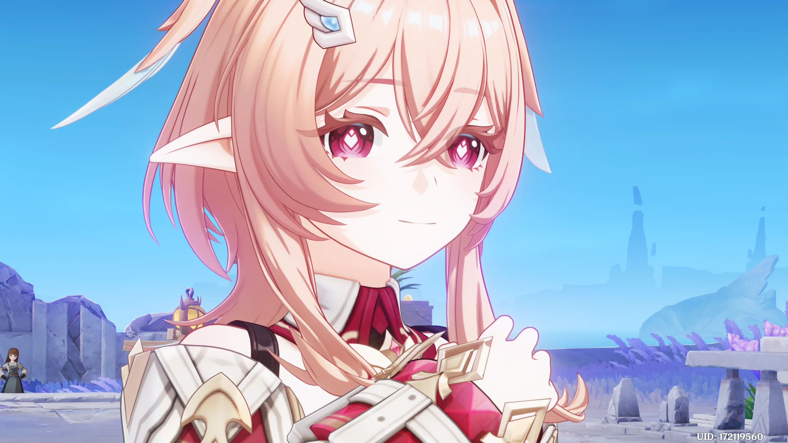

<aside>

**关于这篇文章**

这是一篇关于《原神》传说任务·启喻鸟之章的个人观后感与哲思笔记。**不是攻略，不是剧情整理，是一篇随笔**——记录我在游戏里两次落泪的位置、以及它把我推向「命运」这个话题时所有的犹豫与不甘。

**适合谁读**

- 玩过启喻鸟之章、想看看别人怎么读这段剧情的人
- 对「命运是否可改」这类话题敏感、愿意读细腻向情感分析的人
- 喜欢从游戏剧情向外延展到个人生命体验的笔记

**怎么读这篇文章**

- 一篇按情绪走的散文，没有目录章节，**从头读到尾即可**
- ⚠️ **含启喻鸟之章主线剧情严重剧透**，未通关请慎入
- 配图为游戏内截图，与文字情绪节奏配套

**版权与声明**

本文为个人原创解读，所有观点仅代表作者本人。引用的游戏画面、台词、角色设定版权归 © miHoYo / HoYoverse 所有，本文以非商业评论目的合理使用。

**首发与转载**

- 原文首发：[启喻鸟之章](https://www.notion.so/qianqiulp/3631d0b648218071bb8cc14c82435233)（Notion 公开页）
- 本文采用 [CC BY-NC-ND 4.0](https://creativecommons.org/licenses/by-nc-nd/4.0/deed.zh) 协议发布——允许非商业**完整转载**与**引用片段**，但**禁止改编**、<strong>禁止商业用途</strong>，转载请<strong>保留作者署名</strong>与<strong>首发链接</strong>。
</aside>

最让我难过的是：故事结尾什么意外都没发生，命运依旧改不动，所有挣扎只能化成咽不下去的泪。

**启喻鸟之章**，是《原神》里莉奈娅的传说任务。她头上有一对翅膀——「非人之物的证明」。她不是人类，是冻原妖精出生时偷偷掉包到人类家庭里抚养长大的「换生灵」。从小她就跟身边朋友都不一样，敏感、不安、害怕被发现。后来妖精化的特征越来越明显，她终于鼓起勇气向养父母坦白。然后在决赛那一天，她陷进了一段像梦一样的、关于未来的预言。

养父母在那之后决定北上，去找自己的亲生血脉。莉奈娅却还在替他们说话：「他们人真的很好，不但抚养了我这么多年，还给我留了一笔钱来应急。」

可她说得太轻了。

轻得像在讲别人的事。

她语气底下压着的那点沉，那点凉，藏不住。

> 「去吧，妖精的孩子」
>
> 「到村落与城镇中去吧，和人类朋友手牵着手」
>
> 「……妖精的世界载满你不懂的忧愁」

---

在这段「命定的预言」之下，莉奈娅向我们坦露了心扉。她怎么会从小都那么开朗、那么勇敢呢？在坦白之前她有过很多个睡不着的夜晚。她当然期待他们会说「莉奈娅，就算你不是我们的孩子，我们也爱你」，但她也清楚知道那是不可能的——他们有自己的小孩，她也有自己的亲生父母，谎言不可能一直撑下去。就算心里怕得要死，就算知道自己可能会变成没人要的小孩，她也还是说了。哪怕事实上，人类父母很快就动身离开，只剩她跟海螺帮那群没有家庭的孩子凑成新的家。

被抛弃的小孩哟，你很坚强，甚至太坚强了。

我知道你会毅然踏上眼中正确的道路，就算未必有好结果，也会坚持自己的选择。

我想这也是为什么我会在这一段两次落泪吧。

---

不知道为什么，看的时候我心里一直憋着一股劲。一种夹着无力感的哀伤与彷徨。镜头随着莉奈娅的预言一帧帧回闪，我看着她从对梦的好奇，一步步走到对那些理想的窥见、终将破灭的绝望，再到对命定之死降临的恐惧。

我也好害怕。

就好像，如果我也知道了自己未来的重大节点是怎样的，我会怎么办？我该怎么办？而现实不就是已知的吗？或者说命运难道不是固定的吗？我现在所在的城市、我现在学习的科目、我现在生活的方式，在十几年后真的会有很大的改变吗？不，细节上肯定会变，但重大节点上，我又怎么可能不知道。我又怎么不知道自己很快就会去死呢，或者说，我下一秒还活在世界上就是奇迹吧。但是我明明知道人生的脆弱和珍贵，却还是选择了忽视，选择了闭上双眼，只度今天——我好害怕。

我害怕我自己到底是世界上有意识的高级智能生命体，还是只不过是一个有意识的、随时会紊乱的原子。我害怕答案，也害怕生活。所以我不敢去看莉奈娅在得知确切预言之后会怎么活，我怕她那么耀眼。

怕我自己这么暗。

---

后续姐妹相认、互相通心，看似皆大欢喜，但我只觉得痛心。莉奈娅又一次忍着自己的恐惧，强撑着去开朗、去积极、去做那个传播正能量的人，去好好活着。

莉奈娅对「生活的全部可预知性」给出的答案，或者说老米编剧给的答案，在我看来就是逃避——用「生活值得烦恼的事情很多」这句话，把「如果命运已定」直接归类进去打包带走。难道结局真的只能靠自己？或者说去想这些都没有意义，去做现在想做的事情才有意义吗？过去对于莉奈娅来说是对自己身份的未知；而现在不过是多了些已知的困扰。世界还是这个世界，我还是我，又有什么好怕的呢？

但这也不过是一种逃避吧。

「好好休息，然后，去面对我们的命运吧」——说实话我没法认同莉奈娅的这句话，也没法认同老米给出的这个答案。命运只能面对吗？还是说这是游戏里「虚假之天」设定下，提瓦特原住民的命运？可我们作为主角，难道不是命运的扰动吗？提瓦特命运的例外吗？难道也只能眼睁睁看着莉奈娅去无力地、痛苦地面对自己的命运吗？

我没法接受。

---

我翻遍了人物介绍，莉奈娅最终也没能逃脱命运。可这次剧情里明明有一句暗示，作为降临者的我们——「作为降临者，我的命运不会被干预，所以从未体验过命运被锚定的感觉。世界的规则一定有它存在的必要性，命运同样如此。但一路走来，我也见到了太多想要反抗命运的人。锚定命运……这是否真的是最好的方案呢？如果有一天，我……」

老米，希望你真的是在埋伏笔！

但反观到现实，我们不是降临者，没有主角光环，只能在自己被注定的命运里挣扎、呼吸——真的没有任何办法了吗？难道真的只能像莉奈娅在最后说的，不是「路有很多条，但是结局只有一个」，而是「结局只有一个，但路有很多条」。

哎我不知道。

或许露米因为莉奈娅的期许，差一点打破命运，又证明了命运从来不是那么牢不可破。或者说，比命运更重要的是我们怎么度过当下、怎么珍惜每一天——

这怎么不算一种对生活的逃避呢？

也许吧。至少我今天认真地活过一回，这就够了。

